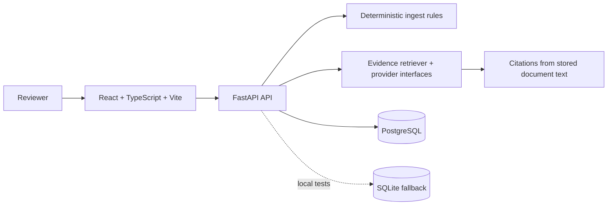

# TrustLedger

TrustLedger is a vendor risk and contract intelligence workspace for teams that need a fast, auditable first pass over third-party evidence. It keeps vendor records, uploaded contracts/questionnaires/policies, explainable risk findings, review state, deadlines, and evidence-backed questions in one focused workflow.

This repository is intentionally a credible vertical slice: the product is runnable locally, the database model is PostgreSQL-ready, and the AI boundary is replaceable. The MVP does not pretend to be a legal reviewer or a production document extraction pipeline.

## Product problem

Vendor managers often spread reviews across shared drives, spreadsheets, and chat. That makes it hard to answer simple questions ("Do they auto-renew?"), explain why a vendor is risky, or prove which document supported a decision. TrustLedger creates a small system of record:

1. Add a vendor and assign an owner.
2. Upload a contract, security questionnaire, or policy text export.
3. The deterministic ingest pipeline hashes the file, prevents duplicates, and extracts bounded risk signals.
4. Review an explainable 0-100 score with severity, detail, and quoted evidence.
5. Ask a question over that vendor's evidence and receive a grounded answer with citations.
6. Track the review status and deadline through the API (the UI is ready for the next workflow iteration).

## Architecture



The frontend is a browser SPA. The API owns validation, authorization seam, risk scoring, document deduplication, deterministic extraction, and Q&A audit events. SQLAlchemy models use UUIDs, relationships, foreign keys, timestamps, and a unique per-vendor content hash. `backend/alembic` is ready for migration workflows; the app startup creates tables for a frictionless demo.

## Data model

- **vendors**: identity, owner, website, review status, review deadline, timestamps.
- **documents**: vendor-owned file metadata, type, SHA-256 hash, extracted text, timestamp. `(vendor_id, content_hash)` is unique.
- **findings**: vendor/document-linked, category, severity, title, detail, and exact evidence quote.
- **qa_events**: question, answer, serialized citations, vendor, timestamp; an audit trail for Q&A.

PostgreSQL uses native UUID columns and enums through SQLAlchemy. Tests use SQLite with a portable UUID type decorator.

## API endpoints

All application routes are under `/api` and return JSON. `X-API-Key` is accepted when `API_KEY` is configured.

| Method | Endpoint | Purpose |
| --- | --- | --- |
| GET | `/health` | Liveness check |
| GET | `/api/vendors` | List vendors, optional `search` |
| POST | `/api/vendors` | Create a vendor |
| GET | `/api/vendors/{id}` | Vendor, evidence, findings, score |
| PATCH | `/api/vendors/{id}` | Update status, owner, or deadline |
| POST | `/api/vendors/{id}/documents` | Multipart upload and deterministic ingest |
| POST | `/api/vendors/{id}/ask` | Evidence-backed question answering |

Every response includes `X-Request-ID` (generated when absent) to make support traces possible without logging document content.

## AI and RAG behavior

`EmbeddingProvider` and `LLMProvider` protocols in `backend/app/services/ai.py` are the seams for a hosted embedding model and LLM later. The checked-in implementation is deterministic and free:

- ingest is UTF-8 text extraction with a strict size bound;
- rules identify a small set of patterns (broad breach windows, subprocessor language, continuity language, auto-renewal, and certifications);
- score starts at 100 and applies documented severity penalties (22 high, 10 medium, 4 low, capped at 0);
- retrieval tokenizes the question and stored sentences, then selects the top lexical overlaps;
- the local answer provider composes a short answer only from retrieved snippets;
- each answer includes document ID, filename, and quote, and is recorded in `qa_events`.

This is real storage, validation, deduplication, retrieval, scoring, and citation behavior. It is not semantic retrieval, OCR, a legal conclusion, a trained model, or a guarantee that absence of a finding means absence of risk. PDF/DOCX parsing and hosted providers are roadmap items.

## Local setup

Requirements: Python 3.12, Node 22, and optionally Docker.

### Fast path with Docker

```bash
cp .env.example .env
docker compose up --build
```

- Web UI: http://localhost:8080
- API docs: http://localhost:8000/docs
- Health: http://localhost:8000/health

### Development without Docker

```bash
# Terminal 1: use SQLite fallback
cd backend
python -m venv .venv && . .venv/bin/activate
pip install -e '.[dev]'
uvicorn app.main:app --reload

# Terminal 2
cd frontend
npm ci
npm run dev
```

For PostgreSQL locally, set `DATABASE_URL` to an asyncpg URL. Copy `backend/.env.example` or the root `.env.example`. Run Alembic commands from `backend` when adopting migrations (`alembic upgrade head`); startup table creation is retained for the demo path.

## Security model

- No secrets are committed. Configuration comes from environment variables and `.env` is ignored.
- Optional API-key authentication is enforced consistently through a FastAPI dependency when `API_KEY` is non-empty. Replace this seam with SSO/OIDC before production.
- CORS is explicitly configured, not wildcarded by default.
- Uploads are bounded by `MAX_UPLOAD_BYTES`, empty files are rejected, filenames are truncated, and hashes prevent duplicate evidence.
- Pydantic validates names, URLs, status values, question length, and upload metadata.
- Errors are safe and generic; request IDs are returned for support. Document contents and questions are not written to application logs.
- Production hardening still needs TLS termination, malware scanning, object storage, encryption/key management, tenant isolation, rate limits, and retention controls.

## Testing and quality

Backend tests cover vendor creation, document upload, duplicate handling, deterministic findings, risk scoring, citations, and provider behavior:

```bash
cd backend
pip install -e '.[dev]'
ruff check app tests
pytest
```

Frontend type-checks and builds with:

```bash
cd frontend
npm ci
npm run build
```

CI runs both checks in `.github/workflows/ci.yml` on pushes and pull requests.

## Tradeoffs and limitations

- Text uploads keep the MVP small and transparent; binary extraction, OCR, and malware scanning are not included.
- Rule-based findings are explainable and testable but intentionally narrow and language-sensitive.
- Lexical retrieval is predictable but weaker than embeddings for paraphrases.
- The UI focuses on the highest-value loop and does not yet include bulk import, comments, approval signatures, or a full review timeline.
- SQLite is a test/demo fallback; PostgreSQL is the Compose deployment target.

## Roadmap

1. Add production authentication and tenant boundaries.
2. Add safe PDF/DOCX extraction, object storage, antivirus scanning, and retention policies.
3. Add hosted/local embedding and LLM adapters with prompt/version audit metadata.
4. Add review task assignment, deadline reminders, approvals, and exportable audit reports.
5. Add semantic and hybrid retrieval with evaluation datasets and answer quality metrics.

## Project layout

```text
backend/              FastAPI, SQLAlchemy models, services, tests, Alembic scaffold
frontend/             React dashboard, vendor drawer, upload and Q&A experience
docker-compose.yml    PostgreSQL, API, and nginx-served frontend
.github/workflows/    Backend and frontend CI
```
